# APAP-Image-Stitching
the APAP image stitching algorithm in python,

requirement: `OpenCV 3.4.2.16`(important), `numpy` , `scikit`

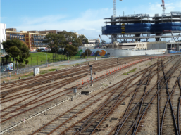

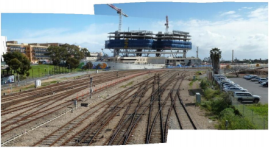

### Image Stitching

#### 1. SIFT

through SIFT algorithm, finding feature points of an image on different scale spaces and matching feature points

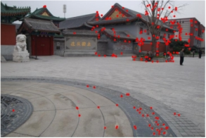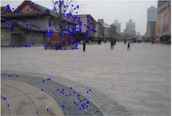

#### 2. RANSAC

The RANSAC algorithm correctly classifies "inner" and "outer" points in a set of data containing "outer" points. (red points: outer,   yellow points: inner)

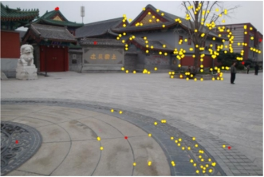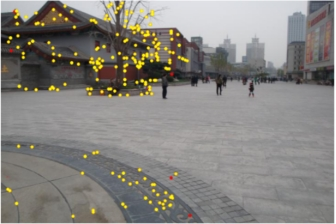

#### 3. Moving DLT

The general flow of the APAP algorithm is as follows:

1. A global homography matrix is calculated using DLT and SVD to predict the size of the panoramic image.

2. Divide the target image with a fixed grid, calculate the Euclidean distance and weight between each grid centroid and each feature point in the target image, construct the matrix by Moving DTL, and use SVD decomposition to find the local homography matrix of the current grid.

3. Use the local homography  matrix to map the target image into the panoramic canvas to obtain the APAP stitched image.

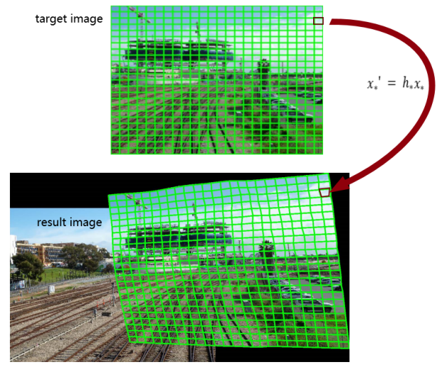

### Image Blending

Seam line fusion algorithm, which calculates the energy value of each pixel in the image using energy function, then finds the seam line with the lowest cumulative energy value using dynamic programming algorithm, finally fuses the two images by feathering the seams.

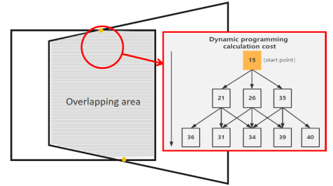

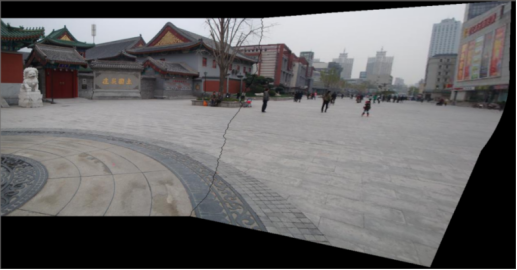

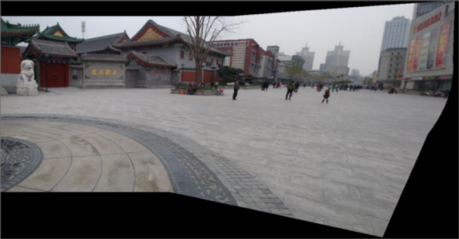

### Example:

example 1:

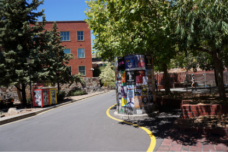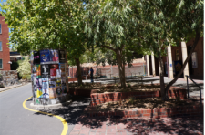

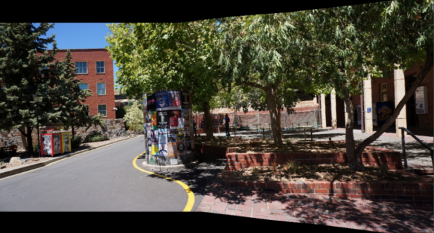

example 2:

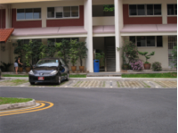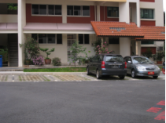

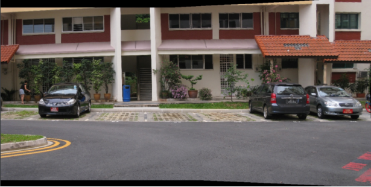

### Document Intro

`main.py`: run the program to stitch two images

`constant.py`: define some parameters, like the original images file path

`seam.py`: find the seam line by DP algorithm

`matcher.py`: matcher to detect and match the feature points
